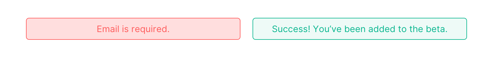

<br/>

# Closed Beta: Track the games you're playing.

This simple vue application pulls from the RAWG API to search through a list of video games. It allows the user to save the games they're currently playing, and then mark those games as complete and assign them a rating.

Link to final project: [www.closed-beta.com](http://www.closed-beta.com)

<br/>

<br/>

## Use conditional logic & JavaScript array methods
**Conditional Logic**<br>
On the "My Games" page, the SEARCH input field is *conditionally rendered* by using ```v-show``` and tying the ADD NEW button to a boolean variable.  **Link to component:** [CurrentList.vue](https://github.com/tannerthelin/tannerthelin-vue-final-project/blob/master/src/components/CurrentList.vue)

```vue
<!-- The button that toggles the variable -->
<button v-on:click= "addSelected = !addSelected"> Add new </button>  

<!-- The input field, using a component called 'Autocomplete' -->
<autocomplete
    class="autocomplete-input"
    placeholder="Search for game..."
    v-show = "addSelected"
</autocomplete> 

<script>
    export default {
        data () {
            return {
                addSelected: false
            }
        }
    }
</script>
```
<br>
**Javascript Array Methods**<br>
When the user deletes a game from their list, it uses ```splice``` to remove the game from the list. When the user marks the game as complete, the app uses ```unshift``` to add it to the Logbook. Both of these actions also ```push``` a string to the Activity array.

## Communicating between components (props & local store)
**Props**
The *Current Games* and *Logged Games* both use ```props``` (pulling from their *parent* list container components) to get the data tied to each game.
<br><br>
**Local Store**
There are 4 arrays in the local store, used to track:<br> 
- User information (*name, email, address*)
- Current Games (*What games the user is currently playing?*)
- Logged Games (*What games has the user finished?*)
- Activity (*Log the user's activity*)

## Present a form for user input that provides useful form validation and feedback
On the *Sign-Up* page, the user can fill-out a form which would add them to the beta. Currently, this form doesn't really do anything, but it'd be cool if it added to a Mailchimp list in the future. The user fills out the fields, and will receive an error if they try to submit without a name or email. If they fill-out all fields, the form will disappear and they will see a success message. <br>
**Link to list component:** [SignIn.vue](https://github.com/tannerthelin/tannerthelin-vue-final-project/blob/master/src/components/SignIn.vue)
<br>


## Create & use a custom directive
I use a custom directive (*on bind*) to check if the game's rating is ```0```. If it is, I toggle a boolean variable within that game called ```ratingZero```, which adds an overlay and a tooltip prompting the user to rate the game.
<br/><br/>
**Link to list component (with the directive):** [LogbookList.vue](https://github.com/tannerthelin/tannerthelin-vue-final-project/blob/master/src/components/LogbookList.vue)
<br/>
**Link to child component (with variable):** [LoggedGame.vue](https://github.com/tannerthelin/tannerthelin-vue-final-project/blob/master/src/components/LoggedGame.vue)
<br/><br/>
<br>

```Javascript
checkForm: function (e) {
    this.success = [];

    if (this.name && this.email) {
        this.success.push('Thank you for enrolling in our beta program! You have been added to our beta list. We will reach out soon!');
    }

    this.errors = [];

    if (!this.name) {
        this.errors.push('Name required.');
    }
    if (!this.email) {
        this.errors.push('Email required.');
    }
    e.preventDefault();
} 
```

## Using animations & transitions
I wrapped my ```router-view``` in a transition tag, giving me a nice little animation every time the user changes routes. I also added this transition tag to the search input on the **My Games** page.
<br>

```css
.slide-enter-active {
    animation: slide-in 150ms ease-out forwards;
  }
  .slide-leave-active {
    animation: slide-out 150ms ease-out forwards;
  }
  @keyframes slide-in {
    from {
      transform: translateY(-10px);
      opacity: 0;
    }
    to {
      transform: translateY(0);
      opacity: 1;
    }
  }
  @keyframes slide-out {
    from {
      transform: translateY(0);
      opacity: 1;
    }
    to {
      transform: translateY(-10px);
      opacity: 0;
    }
  }
```

## Connecting to a server: Axios
For my dynamic data, I decided to use a video game database called [Rawg](https://rawg.io/). There may be a more efficient way of grabbing data in bulk, but whenever my application loads or modififes a game, I make an Axios call using on that game's ID in the *Rawg* database as my argument. Then I assign the game's name & image from the JSON file that is returned.<br><br>I also create a ```shortTitle``` that is shortened to a max of 16 characters, to be used for the logbook. <br><br>
**Link to store, where Axios is called:** [store.js](https://github.com/tannerthelin/tannerthelin-vue-final-project/blob/master/src/store.js)
```Javascript
'MODIFY_GAME' (state, payload) {
    // Declare variables
    let title = '';
    var shortTitle = '';
    var image = '';

    // Axios call
    axios
    .get('https://api.rawg.io/api/games/' + payload.id)
    .then(response => {
        title = response.data.name;
        shortTitle = textEllipsis(response.data.name, 16);
        
        // Set the game's titles
        payload.title = title;
        payload.shortTitle = shortTitle;

        // Grab & set the game's image
        image = response.data.background_image;
        payload.bgImage = image;
    })
    .catch(error => {
        console.log(error)
    });
}
```

## Provide at least 3 different routes using vue-router
Three different routes are used to provide some basic navigation in this application. These routes are accessible via the "3-dot" navigation in the upper-righthand corner, as well as the buttons on the homepage. A *fallback* route is also implemented to direct random URLs to the homepage.  **Link to component:** [router.js](https://github.com/tannerthelin/tannerthelin-vue-final-project/blob/master/src/router.js)

```Javascript
routes: [
    {
      path: '/',
      name: 'home',
      component: Home
    },
    {
      path: '/dashboard',
      name: 'dashboard',
      component: Dashboard
    },
    {
      path: '/sign-in',
      name: 'sign-in',
      component: SignIn
    },
    {
      path: '*',
      component: Home
    }
  ]
```


## Manage your application's state using vuex
As mentioned above, there are 4 arrays in the local store, used to track:<br> 
- User information (*name, email, address*)
- Current Games (*What games the user is currently playing?*)
- Logged Games (*What games has the user finished?*)
- Activity (*Log the user's activity*)
<br>
The store is modified using mutations, which are called by actions. The mutations I use:<br>
- ```DELETE_GAME``` - Delete a game from your list. Currently these are two separate mutations, since the *Logbook* and *Current Games* are two different arrays in ```store```. In the future, I'd like to figure out how to combine these into one.
- ```COMPLETE_GAME``` - Mark a game in the *Current Games* list as completed, moving it to the *Logbook*.
- ```MODIFY_GAME``` - As mentioned above, this mutation includes an axios call, and is used whenever a game is loaded or updated.
<br>
```Javascript
'DELETE_GAME' (state, payload) {
    let index = state.currentGames.indexOf(payload);
    state.currentGames.splice(index, 1);
    state.activity.push("You deleted " + payload.title + " from your Currently Playing.");
},
```
<br>
The application also uses *getters* to retrieve the store information.<br>
```Javascript
getters: {
    getCurrent: state => {return state.currentGames},
    getLogged: state => {return state.loggedGames},
    getActivity: state => {return state.activity},
}
```
