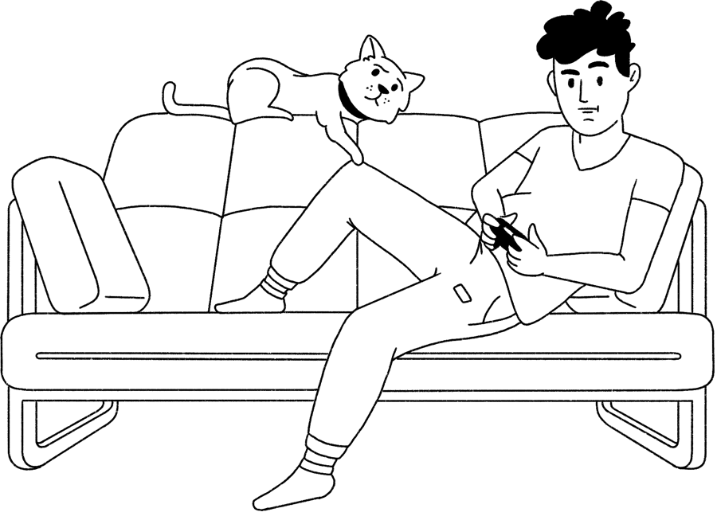
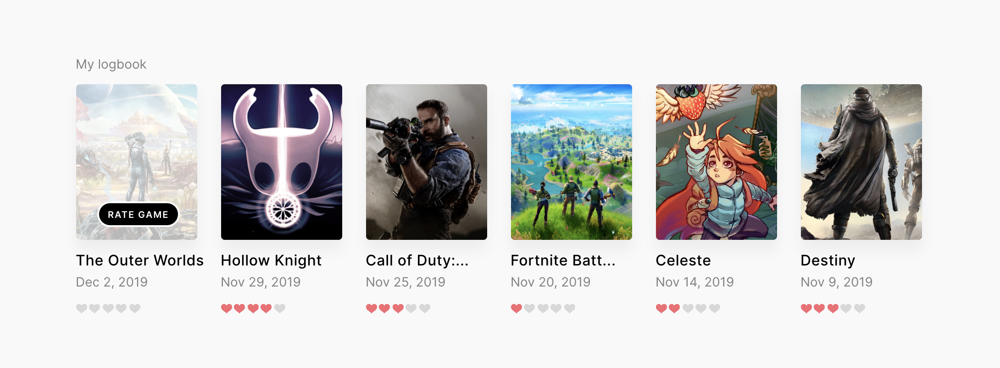

<br/>

# Closed Beta: Track the games you're playing.

This simple vue application pulls from the RAWG API to search through a list of video games. It allows the user to save the games they're currently playing, and then mark those games as complete and assign them a rating.

Link to final project: [www.closed-beta.com](http://www.closed-beta.com)

<br/>

<br/>

## Use conditional logic & JavaScript array methods
**Conditional Logic**<br>
On the "My Games" page, the SEARCH input field is *conditionally rendered* by using ```v-show``` and tying the ADD NEW button to a boolean variable.  **Link to component:** [CurrentList.vue](https://github.com/tannerthelin/tannerthelin-vue-final-project/blob/master/src/components/CurrentList.vue)

```vue
<!-- The button that toggles the variable -->
<button v-on:click= "addSelected = !addSelected"> Add new </button>  

<!-- The input field, using a component called 'Autocomplete' -->
<autocomplete
    class="autocomplete-input"
    placeholder="Search for game..."
    v-show = "addSelected"
</autocomplete> 

<script>
    export default {
        data () {
            return {
                addSelected: false
            }
        }
    }
</script>
```
<br>
**Javascript Array Methods**<br>
When the user deletes a game from their list, it uses ```splice``` to remove the game from the list. When the user marks the game as complete, the app uses ```unshift``` to add it to the Logbook. Both of these actions also ```push``` a string to the Activity array.

## Encapsulate your code as VueJS single-file components


## Work with the Vue-CLI


## Communicating between components (props & local store)


## Present a form for user input that provides useful form validation and feedback


## Create & use a custom directive
I use a custom directive (*on bind*) to check if the game's rating is ```0```. If it is, I toggle a boolean variable within that game called ```ratingZero```, which adds an overlay and a tooltip prompting the user to rate the game.
<br/><br/>
**Link to list component (with the directive):** [LogbookList.vue](https://github.com/tannerthelin/tannerthelin-vue-final-project/blob/master/src/components/LogbookList.vue)
<br/>
**Link to child component (with variable):** [LoggedGame.vue](https://github.com/tannerthelin/tannerthelin-vue-final-project/blob/master/src/components/LoggedGame.vue)
<br/><br/>



## Using animations & transitions
I wrapped my ```router-view``` in a transition tag, giving me a nice little animation every time the user changes routes. I also added this transition tag to the search input on the **My Games** page.
<br>
```css
.slide-enter-active {
    animation: slide-in 150ms ease-out forwards;
  }
  .slide-leave-active {
    animation: slide-out 150ms ease-out forwards;
  }
  @keyframes slide-in {
    from {
      transform: translateY(-10px);
      opacity: 0;
    }
    to {
      transform: translateY(0);
      opacity: 1;
    }
  }
  @keyframes slide-out {
    from {
      transform: translateY(0);
      opacity: 1;
    }
    to {
      transform: translateY(-10px);
      opacity: 0;
    }
  }
```

## Connecting to a server: Axios


## Provide at least 3 different routes using vue-router
Three different routes are used to provide some basic navigation in this application. These routes are accessible via the "3-dot" navigation in the upper-righthand corner, as well as the buttons on the homepage. A *fallback* route is also implemented to direct random URLs to the homepage.  **Link to component:** [router.js](https://github.com/tannerthelin/tannerthelin-vue-final-project/blob/master/src/router.js)

```Javascript
routes: [
    {
      path: '/',
      name: 'home',
      component: Home
    },
    {
      path: '/dashboard',
      name: 'dashboard',
      component: Dashboard
    },
    {
      path: '/sign-in',
      name: 'sign-in',
      component: SignIn
    },
    {
      path: '*',
      component: Home
    }
  ]
```


## Manage your application's state using vuex


## Deploy your final project code according to common industry practices

