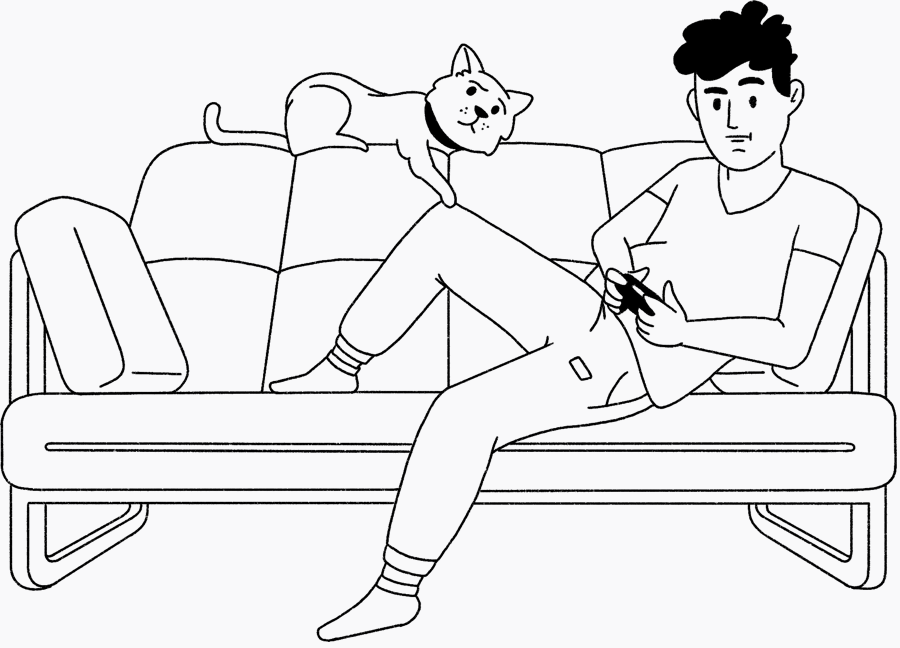

<!-- 
# Closed Beta: Track the games you're playing. -->

This simple vue application pulls from the RAWG API to search through a list of video games. It allows the user to save the games they're currently playing, and then mark those games as complete and assign them a rating.

Link to final project: [www.closed-beta.com](http://www.closed-beta.com)

<!--  -->

## Use conditional logic & JavaScript array methods to render large lists.

## Encapsulate your code as VueJS single-file components.

## Work with the Vue-CLI to create and manage your project within a real development toolset.

## Properly use Git for your source version control with an established record of at least 4 days of commits each week from October 15th through December 6th.

## Allow communication between components using props, custom events, or local store.

## Present a form for user input that provides useful form validation and feedback.

## Create a custom directive and use it on at least one of your components.

## Use a mix of animations and transitions to enhance some aspects of your project.

## Connecting to a server: Axios

## Provide at least 3 different routes using vue-router

## Manage your application's state using vuex

## Structure, document, and deploy your final project code according to common industry practices.

